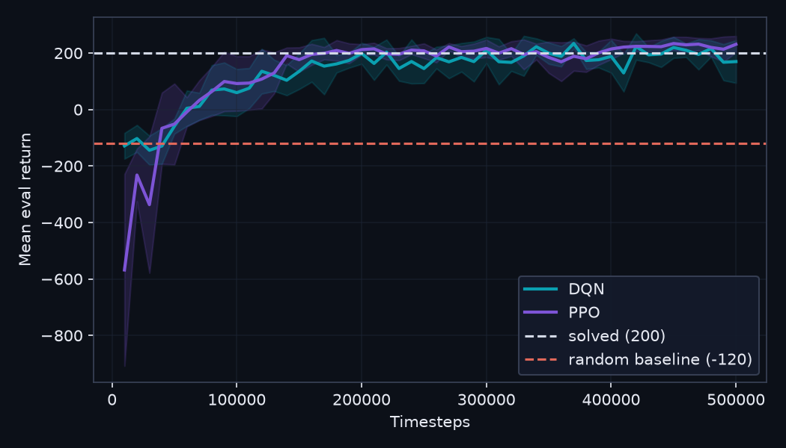

# Lunar Lander: DQN vs. PPO

A reproducible pipeline comparing two Deep Reinforcement Learning algorithms —
**DQN** (value-based) and **PPO** (policy-gradient) — on Gymnasium's
`LunarLander-v3`. The comparison covers **final performance, sample efficiency, and
training stability**, with statistical significance testing (Welch's t-test,
Mann-Whitney-U, Cohen's d, confidence intervals) across multiple random seeds.

> Course project for the EU4DUAL Master Class AI (Mondragon Unibertsitatea · DHBW CAS
> Heilbronn). Authors: Fabian Glück, Hendrick Fischer, Stefanie Kirchner.

## Key results

Tuned with Optuna, trained for 500k steps × 5 seeds, evaluated on the best checkpoint
(early stopping); 100 evaluation episodes.

| Metric | DQN | PPO |
|---|---|---|
| best model (mean ± std) | 236 ± 10 | 240 ± 18 |
| seeds solved (≥ 200) | 5 / 5 | 5 / 5 |
| final model (end of training) | 152 ± 65 | 219 ± 39 |
| steps to reach mean ≥ 200 | ≈ 220k | ≈ 180k |

- **No statistically significant difference in final score** (Welch p = 0.68,
  Cohen's d = −0.27, 95% CI of the difference includes 0).
- **PPO is more sample-efficient and markedly more stable**; DQN suffers late-training
  performance collapse (catastrophic forgetting) → best-checkpoint selection is essential.
- **Search space > compute:** widening the PPO hyperparameter ranges (params sat at the
  edges) lifted PPO from **240 → 254** at the *same* 500k budget.



More detail: [`docs/poster-content.md`](docs/poster-content.md) and
[`docs/notes.md`](docs/notes.md).

## Architecture

The pipeline is **algorithm-agnostic**: `src/lunarlander/agents.py` is the only module
that knows about DQN vs. PPO. Everything else (train / evaluate / tune / stats / plots)
stays algorithm-blind, so adding a third algorithm only means plugging it into `agents.py`.

| Module | Purpose |
|---|---|
| `config` | constants & repo-anchored paths |
| `envs` | `make_env` |
| `agents` | `make_agent` / `load_agent` (only algo-aware module) |
| `train` / `evaluate` | training loop & evaluation |
| `tune` | Optuna hyperparameter search |
| `stats` | Welch t-test, CIs, Cohen's d, Mann-Whitney-U |
| `plots` | poster figures |

`scripts/` holds the CLI entry points for long runs; `results/` (gitignored) collects output.

## Usage

Requires [`uv`](https://docs.astral.sh/uv/) and Python 3.12.

```bash
uv sync                                              # install dependencies
uv run pytest -q                                     # run tests

uv run python -m scripts.run_tuning --algo dqn --trials 30   # hyperparameter search
uv run python -m scripts.run_final_eval --algo dqn           # final training + eval
uv run tensorboard --logdir results/tb                       # monitor final runs
```

Analysis and poster figures are regenerated from `notebooks/03_analysis.ipynb`.

## License / attribution

The code in this repository is the authors' own work. `LunarLander-v3` is provided by
[Gymnasium](https://gymnasium.farama.org/); training uses
[Stable-Baselines3](https://stable-baselines3.readthedocs.io/) and
[Optuna](https://optuna.org/).
